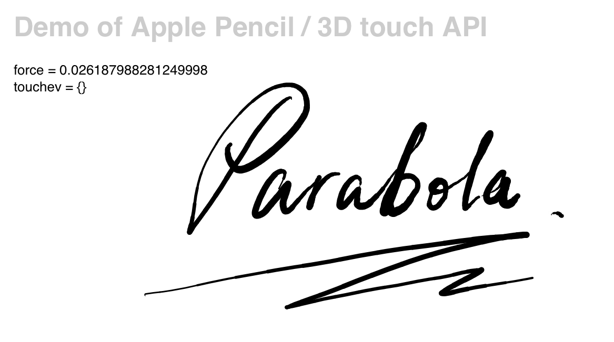

3D Touch / Force Touch API Demo

A canvas demo featuring:

- __Apple Pencil__ and __3D Touch__ pressure detection
- smooth Bezier curve drawing

In vanilla JS. Tested in Safari & Google Chrome on iOS 9.3.

[Demo](http://quietshu.github.io/apple-pencil-safari-api-test) | [Code](https://github.com/quietshu/apple-pencil-safari-api-test/blob/gh-pages/index.html).

__Help me test on Android/Windows/macOS devices and leave an issue please!__

|API |Capability (Apple devices with iOS 9)|Capability (Apple devices with iOS 13)|
|---|---|---|
|force|:white_check_mark:|:white_check_mark:|
|radiusX|:x:|:white_check_mark:|
|radiusY|:x:|:white_check_mark:|
|rotationAngle|:x:|:question:|
|touchType|:question:|:white_check_mark:|
|altitudeAngle|:question:|:white_check_mark:|
|azimuthAngle|:question:|:white_check_mark:|

## Related Resources

1. [Touch Events - Level 2, W3C Draft](https://w3c.github.io/touch-events/#widl-Touch-force)
2. [The `Touch` Object on MDN](https://developer.mozilla.org/en-US/docs/Web/API/Touch)
3. [`radiusX`](https://developer.mozilla.org/en-US/docs/Web/API/Touch/radiusX)

## Pointer Events & Polyfills

- [Pointer Events on W3C](https://www.w3.org/TR/pointerevents/#h2_intro)
- [Microsoft Edge](https://msdn.microsoft.com/en-us/library/dn433244%28v=vs.85%29.aspx?f=255&MSPPError=-2147217396)
- Hand.js -> [jQuery PEP](https://github.com/jquery/PEP).
- MSPointerXXX: [MSDN Blog](https://blogs.msdn.microsoft.com/eternalcoding/2013/02/20/hand-js-a-polyfill-for-supporting-pointer-events-on-every-browser/)
